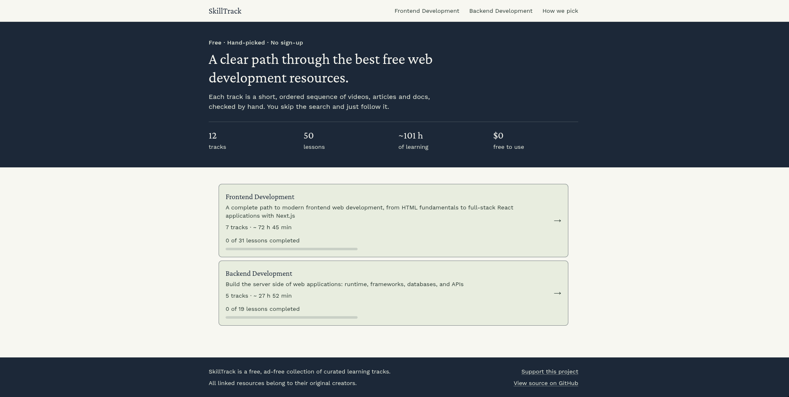
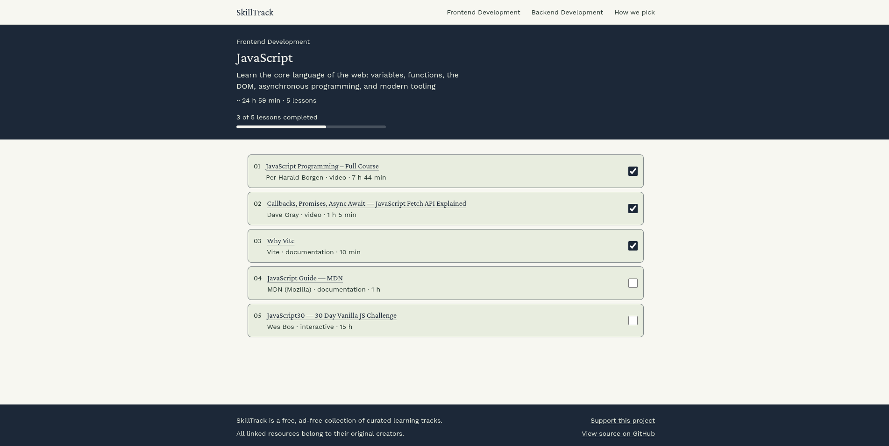

# SkillTrack

Free, curated learning tracks for modern web development.

**Live:** https://skilltrack-dev.vercel.app



SkillTrack is not a course platform and does not host any content. It is a hand-picked path through the best free resources on the web: each track is an ordered list of lessons (videos, articles, documentation, interactive tutorials) with the author and the time it takes, so a beginner can see what to learn next without drowning in search results.



## What makes it different

Every resource is checked by hand before it is published. A lesson has to be:

- **Current:** up to date with the versions people actually use today
- **Reputable:** from an author or organization worth trusting
- **Free and open:** no paywall and no sign-up needed to start
- **Beginner-friendly and practical:** it teaches by doing

If nothing good enough exists for a topic, there is no track for it yet. The criteria are public on the [How we pick](https://skilltrack-dev.vercel.app/how-we-pick) page.

## Features

- Directions (Frontend, Backend) that group tracks by topic
- Tracks with ordered lessons, authors, resource types and durations
- Progress tracking: tick off lessons and see progress per track and per direction
- No account needed: progress is stored in your browser (`localStorage`)
- A "How we pick" page that explains the four criteria every resource must meet
- Per-page metadata, Open Graph images, `sitemap.xml` and `robots.txt`

## Quality

- **Lighthouse** (lab, October 2026): Desktop 100 / 100 / 100 / 100, Mobile 97 / 100 / 100 / 100 (Performance / Accessibility / Best Practices / SEO)
- **Dependencies:** `npm audit --omit=dev` reports 0 vulnerabilities. The few remaining advisories are in dev-only ESLint tooling and never reach production.
- **Checks:** `npm run lint` and `npm run typecheck` run clean; TypeScript is in strict mode.

## Tech stack

- [Next.js](https://nextjs.org) 16 (App Router), React 19 with the React Compiler, TypeScript (strict)
- [Tailwind CSS](https://tailwindcss.com) v4
- [Storyblok](https://www.storyblok.com) as the headless CMS for all content
- [Zustand](https://zustand.docs.pmnd.rs) for client-side progress state
- Deployed on [Vercel](https://vercel.com)

## How it works

- **Content model:** a Direction contains Tracks, and a Track contains Lessons. All of it is edited in Storyblok.
- **Rendering:** pages are prerendered at build time with `generateStaticParams` and regenerated at most once an hour (ISR), so navigation is instant.
- **Fresh content:** a Storyblok webhook calls `POST /api/revalidate` on publish, so edits show up without a redeploy. The endpoint verifies the webhook's HMAC signature and rejects any other request with `401`.
- **Data access:** every Storyblok request lives in `src/lib/storyblok-queries.ts` (cached per render with React `cache()`); pages only render the result.

## Key decisions

- **Static pages with ISR instead of server rendering.** The content changes rarely and is the same for every visitor. Prerendered pages are fast and cheap to host, and the webhook keeps them fresh.
- **A headless CMS instead of hard-coded data.** Adding or fixing a lesson is an edit in Storyblok, not a code change and a redeploy.
- **Progress lives in the browser.** Zustand with `persist` writes to `localStorage`, so there are no accounts, no backend and no personal data to protect. The trade-off is that progress does not sync across devices.
- **No accounts for now.** A sign-in with a database would add cost and maintenance to a free, read-mostly product. The idea is parked until the product needs it.
- **Curation over catalog size.** A track exists only if there are enough good resources for it, and the selection criteria are published on the site.
- **A locked-down revalidation endpoint.** `/api/revalidate` checks Storyblok's HMAC-SHA1 signature with a timing-safe comparison and fails closed: if the secret is not configured, nobody can trigger a revalidation.

## Project structure

```
src/
  app/            routes: home, directions/[slug], tracks/[slug], how-we-pick,
                  api/revalidate, sitemap, robots, icons and Open Graph images
  components/     UI: header, footer, progress bar, lesson checkbox
  hooks/          progress hooks built on the store
  lib/            Storyblok client and queries, types, SEO helper, site config
  stores/         Zustand progress store
docs/
  screenshots/    images used in this README
```

## Running locally

The content lives in a private Storyblok space, so to run your own copy you need a Storyblok space with the same content model (Direction, Course, Lesson) and a public access token.

```bash
npm install
```

Create `.env.local` (it is git-ignored):

```
NEXT_PUBLIC_STORYBLOK_TOKEN=your_public_access_token
REVALIDATE_SECRET=any_long_random_string
```

`REVALIDATE_SECRET` must match the secret set on the Storyblok webhook; `POST /api/revalidate` rejects requests whose `webhook-signature` does not match.

Then:

```bash
npm run dev        # development server on http://localhost:3000
npm run build      # production build
npm start          # run the production build
npm run lint       # ESLint
npm run typecheck  # TypeScript check
```

Note: `npm run dev` compiles pages on demand and feels slower than production. Judge real speed with `npm run build && npm start`.

## Status and roadmap

Version 0 is live: static curated content and local progress tracking.

Planned:

- More directions (for example web design), added only when there are enough high-quality resources to make a track worth following

